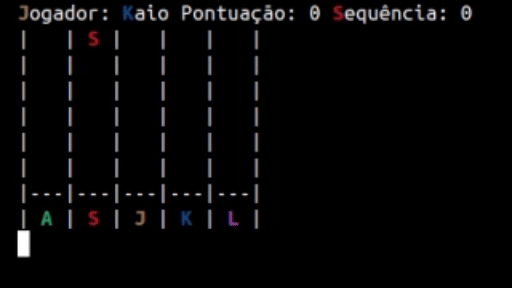

# 🎸 Guitar Hero - Paradigmas de Linguagem de Programação (2024.1) UFCG


## **Projeto de desenvolvimento em Prolog e Haskell de uma versão simplificada do jogo Guitar Hero jogável pelo terminal.**

### Descrição do Projeto:

- **O projeto consiste em uma recriação do jogo Guitar Hero, onde o jogador deve acertar as notas musicais à medida que elas "caem" pela tela. O jogo é baseado em caracteres ASCII e permite que os jogadores escolham DOIS diferentes níveis de dificuldade. Há também um sistema de pontuação que é bonificada por acertos consecutivos.**

### Funcionalidades Principais:

- **Jogabilidade no Terminal**: O jogo é inteiramente jogado no terminal, utilizando caracteres ASCII para representar as notas musicais.
- **Níveis de Dificuldade**: O jogador pode escolher entre dois diferentes níveis de dificuldade, que alteram a quantidade de notas que caem.
- **Sistema de Pontuação**: O jogador ganha pontos por cada nota acertada, com bônus por sequências de acertos consecutivos.
- **Reprodução de Música**: As músicas são reproduzidas durante o jogo utilizando os comandos `cvlc`
  
- **Interface Simples e Intuitiva**: O projeto visa oferecer uma experiência simples e divertida, acessível a qualquer pessoa familiarizada com o terminal.

## Excecução em Prolog:


- **Para tocar as músicas, é necessário instalar o vlc no seu computador:**

  ```bash
  sudo apt install vlc
  ```
    
## Como Executar em Prolog:

- **Para rodar o projeto, é necessário ter o Prolog instalado. Siga os passos abaixo para executar o jogo:**

1. **Clone este repositório e entre no diretório prolog:**
    
    ```bash
    git clone https://github.com/Geovam-1/Guitar_Hero.git
    cd Guitar_Hero/prolog/
    ```
2. **Execute o arquivo do jogo:**

   ```bash
   swipl guitarprolog.pl
   ```
3. **Chame o jogo no prolog:**

   ```bash
   menu.
   ```
**Siga as instruções na tela para jogar.**

## Como Executar em Haskell:

- **Para rodar o projeto, é necessário ter o Haskell e Stack instalado. Siga os passos abaixo para executar o jogo:**

1. **Instalar o stack:**

   ```bash
   sudo apt install haskell-stack
   ```

2. **Clone este repositório:**
    
    ```bash
    git clone https://github.com/Geovam-1/Guitar_Hero.git
    cd Guitar_Hero/
    ```
    
3. **Configurar o projeto:**
  
    ```bash
    stack init
    ```
4. **Execute o jogo:**
    
    ```bash
    stack run
    ```
          
**Siga as instruções na tela para jogar.**

## **Autores**

- Geovam - [Geovam-1](https://github.com/Geovam-1)
- João Vitor - [Jvitorsouz](https://github.com/Jvitorsouz)
- Kaio - [KaioCar64](https://github.com/KaioCar64)
- Raylla - [Rayllac](https://github.com/Rayllac)
- Thawany -[Thawanyfernandes](https://github.com/Thawanyfernandes)
